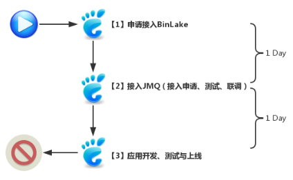

# binlake 

BinLake是一个集群化的数据库Binary Log管理、采集和分发系统，并且透明集成JMQ和Kafka等消息分发和订阅系统。

##　背景

* 项目背景  
    BinLake之前，各个业务部门若想要对数据库的binlog日志进行采集和订阅，并根据订阅到的BinLog日志进行分析并实现特定的业务目标需要经过：
    
    * 日志采集产品调研[**canal**](https://github.com/alibaba/canal)
    * 资源申请
    * Binary Log采集服务部署
    * 发布订阅系统调研（eg:kafka）
    * 日志采集与消息发布订阅系统集成开发与测试
    * 业务应用开发、测试、上线  

    按照上述步骤依次进行，我们发现在步入正题（业务系统研发）之前，我们需要做的太多太多，这种方式既费时又费力，工作效率及其低下。  
    
    除此之外，在BinLake出现之前，各个业务部门需要若想要基于MySQL 的Binary Log进行进行业务研发， 每个部门都需要配备专业的日志采集和消息处理的专业工程师，
    并且都需要从头到尾将整个技术堆栈重新梳理和调研一遍， 并且一旦项目上线，后续还需要持续的投入人员对基础服务和平台进行持续的运维和管理。    
    
    这种方式存在极大的人员和资源浪费，由于各个部门都是自己另立炉灶， 各个部门系统的稳定性大部分都是有研发人员兼职保证、部门之间存在技术壁垒、资源不能共享、监控和预警机制简陋等。

## 目标  
* 目标    
    * 提高研发效率  
        BinLake旨在提高基于数据库Binary Log的业务系统的研发效率，缩短研发周期。  
        业务研发部门通过使用BinLake，可以透明的实现数据库Binary Log的自动化采集、分发和订阅，因此无需再重复的花费时间进行实际业务研发工作之前的基础技术调研和基础平台建设，因为所有这些工作，均由BinLake为您提供。
        使用BinLake服务将会极大的所有研发周期，提升研发效率，其系统开发步骤如下：    
            
        从上图可以看到使用了使用了BinLake之后， 在进行实际的业务系统研发之前，不用再自建数据库日志采集、管理、发布和订阅系统，而是直接申请接入BinLake集群，然后接入JMQ或者Kafka即可，而这两部申请工作均有线上系统提供申请入口
        
    * 实现技术和资源共享  
        BinLake坚持技术和资源共享的原则，为京东商城各个业务部门提供统一的资源和技术服务，
        各个业务部门通过使用BinLake服务，避免的重复投入人力对同一项技术进行研究，避免了各个部门为了满足同一种业务需求而重复申请资源，
        进而避免的资源浪费，避免的各个业务部门重复投入人力和物力进行数据库日志采集、管理、分发、订阅系统的运维。

## 原理介绍  
[BinLake-principle](./doc/binlake-principle.md)  

## 架构设计  
[BinLake-arc](./doc/binlake-arc.md)  

## 部署方案  
[BinLake-deploy](./doc/binlake-deploy.md)  

## 使用文档  
[BinLake-start](./doc/binlake-start.md)  

## 开源引用  
[BinLake-quote](./doc/binlake-quote.md)

## Q&A 
[Binlake-qa](./doc/binlake-qa.md)  

## 交流 

* wx 群   
    欢迎wx 搜索 binlake 

* mail 邮件  
    pengaan@163.com  
