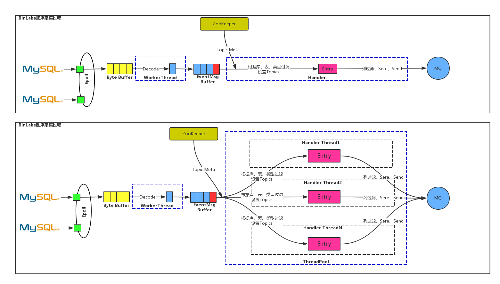
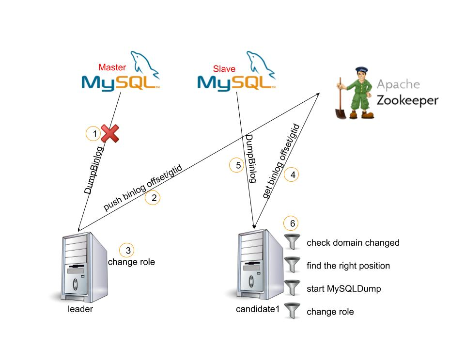

# binlake-wave.server 

binlake服务端，负责组合各个模块功能，异常关闭处理，消息处理流程等核心过程等.

## 消息处理流程  

消息处理过程分为多种顺序类型，包括严格实例顺序，库顺序，表顺序，业务主键顺序，事务顺序 等.




## 异常处理  
异常问题包括，MySQL dump io断开、切换，zk断开，mq发送失败，数据包错误 等. 

下图是展示MySQL实例域名切换的处理过程  


## 使用说明  

启动binlake-wave.server 分为三步: 编译 参数配置 启动服务 

### 编译    

* 依赖  
    依赖于zk服务集群

* 编译说明  
    服务编译部署包括 binalke-wave.server
    
    * jdk 使用1.7以上版本  
        因为jdk1.7 以上才开始使用g1 gc算法 
    
    * 安装maven 2.3以上版本  
        设置环境变量 
        ```text
        pengan@pengan:binlake$ alias mvn
        alias mvn='/export/servers/apache-maven-3.6.0/bin/mvn --settings=/export/servers/apache-maven-3.6.0/conf/settings.xml'
        ```
    
    * 下载源码  
    ```text
    git clone https://github.com/jd-tiger/binlake
    ```
    
    * 编译打包    
    ```text
    mvn install -Dmaven.test.skip=true
    # 获取wave service安装包 binlake-wave/binlake-wave.server/target/binlake-wave.server-3.0-server.tar.gz 
    ```
    
### 参数配置   
binlake-wave.server 启动时候需要配置的参数有三块: jvm参数, properties文件, 日志文件路径 
下面分别对三类配置进行说明  

* jvm参数  
```text
# ./bin/start.sh 脚本 
-server -Xms12g -Xmx12g -Xss1024k 
完全可以根据docker或者物理机的配置来自行配置 
```
jvm配置可以[参考](https://docs.oracle.com/javase/8/docs/technotes/tools/windows/java.html)  

* **properties** 文件
properties 配置文件包含两个: config.properties, realtime.properties

    * config.properties 
        配置用于启动binlake-wave.server服务 指定线程并发数量, zk的地址等等
        下框详细说明每个配置的含义以及默认值  
        
        参数名 | 含义 | 默认值  
        :--- | :--- | :---:  
        zk.path.meta | zk当中元数据根路径 | /zk/wave3
        zk.servers | zk 集群地址 最好用域名 | 127.0.0.1:2181 
        wave.timer.period | 数据写入zk 定时器timer 的时间间隔 单位 毫秒 | 60000
        wave.server.throttle.size | 流控buffer size | 16 
        wave.server.processors | 并行处理的线程个数 | 4 
        wave.http.server.port | wave http模块对外端口 | 8083 
        wave.agent.server.port | wave agent 服务对外端口 | 4006 
        wave.dump.latch | binlog dump 分布式集群 重试次数 超过重试次数则开始报警  | 9
        wave.kill.latch | kill preleader 分布式集群重复次数 | 

    * realtime.properties 
        用于配置需要及时生效的配置选项 但是这些选项又不属于整个集群或则每个集群由于部署的位置不一致导致参数不一样  
        
        参数名 | 含义 | 默认值 
        :--- | :--- | :--- 
        flush.binlog.offset | 强制刷新binlog offset | false 
        ump.access | 是否接入公司统一监控(实现 **IPerformance** 接口) | false
        alarm.contact.phone.number | 报警联系人手机号,逗号分隔符 | ******
        alarm.contact.token | 调用短信报警url 需要的token | *****
        alarm.contact.url | 调用短信报警的url | ****   

        以上参数根据需要设置 如果不需要可以直接从管理端查看 需要则需要统一配置 

* log 配置  
    日志的配置添加了WatchDog也是及时生效的, 日志类型分为4类: debug, info, warn, error   
    用户完全可以自定义一些日志或者舍弃部分日志
   
### 启动服务  
```shell
# 解压tar包

# 配置参数 

# 运行service
cd binlake-wave.server-3.0/bin/ && ./start.sh 
```


## 说明 
properties 参数都是必须参数 
