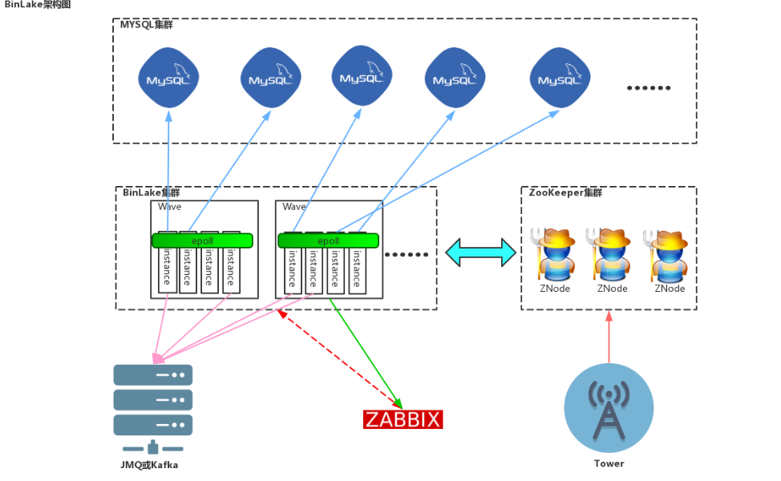
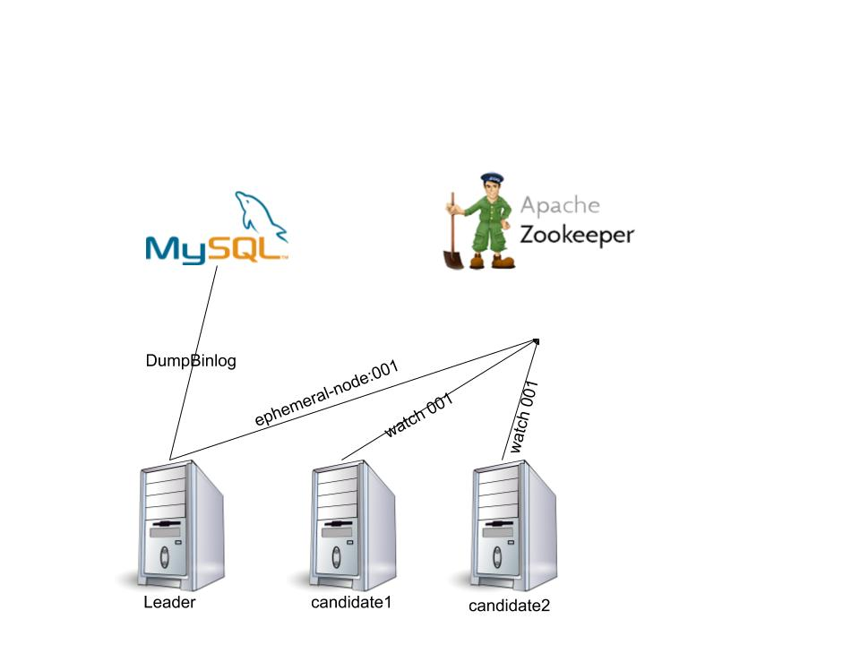
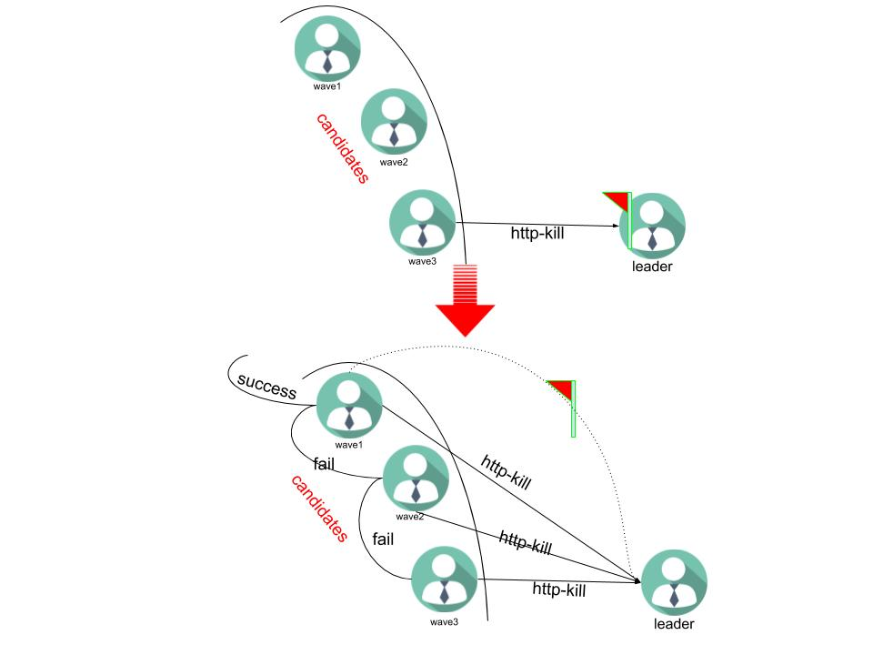

# binlake-arc
介绍binlake 软件架构设计以及设计中考虑到的一些问题解决方案

## 架构图 
  

## 目标  

* 目标  
    * 分布式集群任意横向扩展  
        集群当中任意添加、删除节点能够降低、增加集群负载的同时不对原有集群造成任何影响    
	* wave服务的无状态  
	    确保集群内部服务之间没有角色的负担, 不需要保存节点的状态
	* 服务之间的互为主备  
	    master出现异常,  follower可以迅速承担任务  
	* dump 延迟动态均衡  
	    每一个实例dump都存在一定的延迟, 如何尽量保证在集群内部延迟的均匀性  
	* 单点服务异常集群内部自由切换  
	    确保集群在单点或者部分节点出现故障无法修复时依然能够准确持续提供服务  

## 解决方案  

* 服务无状态设计    
整个集群无状态,  任何一次zookeeper当中监听节点下子节点的变更都会从zk上得到通知, 并且开始提供服务且保证, 针对任何一台MySQL服务,  有且仅有一台wave服务提供 binlog dump

* HA    
zk的高可用, wave service 每次更新都会将数据写入到zk, 保证新的位置不会丢失, 但会出现一部分的重复数据, 下图介绍切换过程:   
  

* leader主备切换  
leader之间的切换采用与**HDFS** **NameNode** 类似的处理方式, 解决leader切换过程当中出现的脑裂问题  
  

* dump 延迟动态均衡  
延迟delay 动态均衡采用实现采用http交互通信, 定时刷新节点的dump延迟, 作为节点切换的参考数据  
  