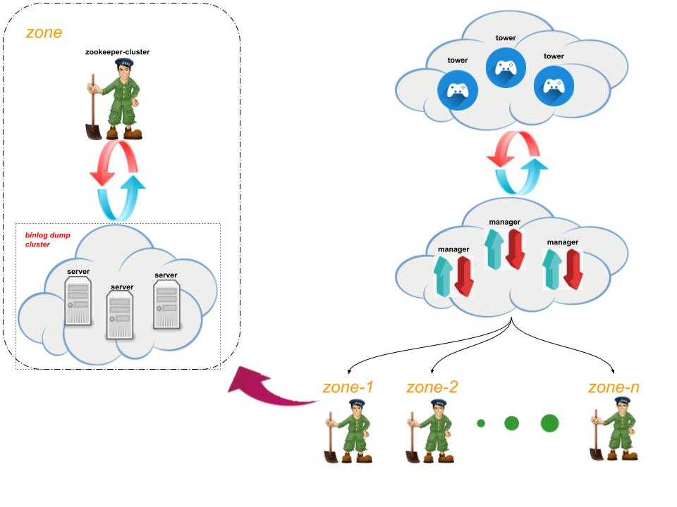

# binlake-deploy 

介绍binlake部署架构以及部署的策略  

## 部署架构图  
  

### 目标 

binlake 以上部署方式的目标如下所示 
* 运维简洁高效    
    减少运维压力, 采用中控命令下发的方式来调控整个集群  
* 服务之间解耦  
    尽量将服务与内部系统之间解耦, 剥离业务层逻辑对系统部署架构的影响  
* 服务内部自治  
    与外部系统之间的逻辑控制与manager, wave sever解耦, wave-server 集群内部实现自治, manager与wave-server集群不直接通信 实现服务内部自治管理

### 说明  
* manager存在的意义  
    * 保护zk集群  
        binlake-manager仅对tower暴露一定的接口, 用于阻挡中控tower 对zk元数据的随意修改, 保持zk当中元数据的整洁
     
    * 保护集群稳定    
        因为zk的元数据的任何修改都会同步到dump集群, 这样子可以拦截前端的无效请求, 并且不会对整个后端集群产生直接影响  

* tower管理所有集群  
    * 降低运维压力  
        一套管理端，管理所有集群，很大程度上减少运维的压力， 多套系统必然会增加管理员以及用户的使用成本  
        在管理多个版本、版本升级时， 统一管理端省时省力效果尤其突出  
     
    * 简化与外部系统交互  
        多套管理端必然对应有不同的配置信息， 一旦与某一个外部系统有交互则需要区别配置 增加在开发以及测试上的成本

* 每个zone有一套集群  
    * 一个zone保留一套集群是为减少不必要的带宽的延迟, 当然这个可以从应用的角度来考虑, 毕竟从客户端的角度来讲, 是从MQ接收消息  

## 快速部署   
[快速部署样例](./binlake-demo.md)