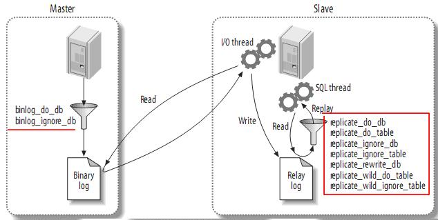

# binlake-principle 
介紹binlake工作原理分为三个过程: 注册MySQL从库, dump并解析MySQL binlog 事件, 封装事件组成指定的消息格式发送到MQ  

## 工作原理介绍 
下面从三部分分别介绍 BinLake的工作原理 

### 注册MySQL从库    
MySQL slave原理是模拟MySQL slave, dump增量的binlog, 并解析生成消息对象发往MQ的过程;
 
以下是原理图: 

### dump并解析MySQL binlog事件  
[**MySQL binlog协议**](https://dev.mysql.com/doc/internals/en/replication-protocol.html) 

### 封装发送消息 
封装业务方需要的数据成特定的格式, 目前支持{avro, protobuf} 格式, 将消息根据特定的顺序{实例级别顺序, 库顺序, 表顺序, 业务主键顺序 等} 发往MQ

## 说明  
* 分成三部分  
    分成三部分, 三部分是可以完全独立的模块
    实现消息的复用 减少数据的拷贝, 只需要一个数据载体将数据分发往不同的topic
       
